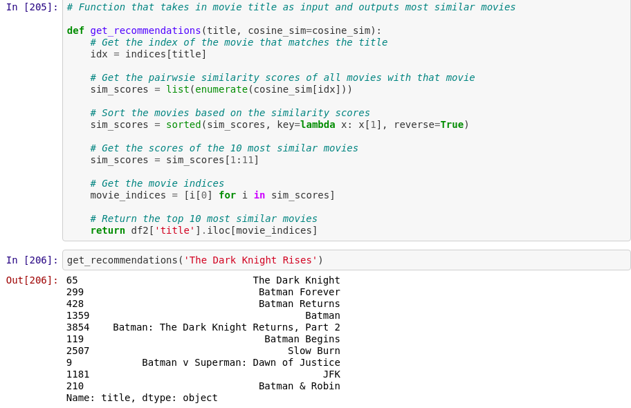

# Recommandation_System-

##### This is collaborative filtering based recommendation system.
I use dataset from kaggle of TMBD dataset.

### How it works 
Movie plot based recommender We will compute pairwise similarity scores for all movies based on their plot descriptions and recommend movies based on that similarity score. The plot description is given in the overview feature of our dataset.
After that we have to calculate the TF-IDF Score from the whole courpus.
TF ->  Frequency of a word over a sentance.
IDF -> How significant the term is in a whole coupus.

Since we have used the TF-IDF vectorizer, calculating the dot product will directly give us the cosine similarity score. Therefore, we will use sklearn's linear_kernel() instead of cosine_similarities() since it is faster.

Now, User enter the name of movie in which he is intreasted after that we saw a list of top 10 movie related to that. 

